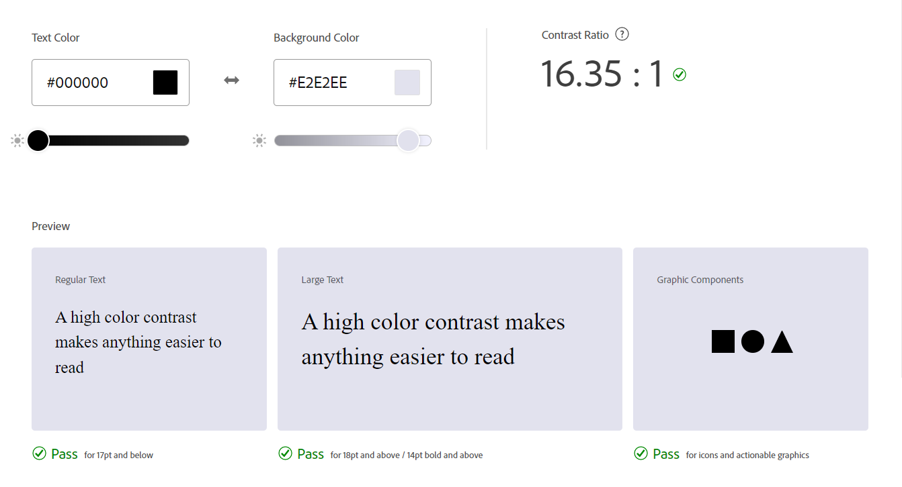
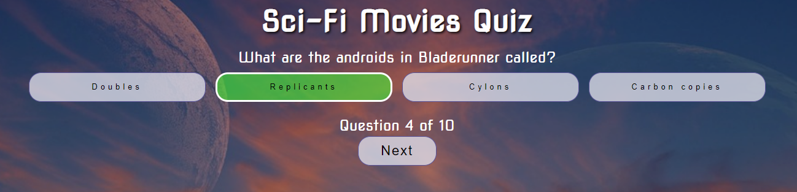
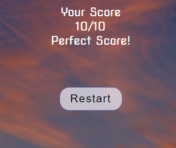
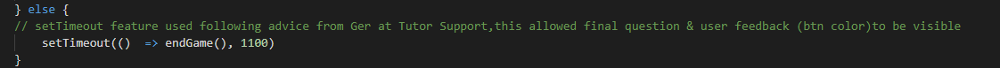

# Sci-Fi Movies Quiz

View the deployed site [here:](https://simgriff.github.io/sci-fi-movies-quiz-pp2/)

## Introduction
The Sci-Fi movies Quiz game is a multiple choice quiz that tests your knowledge of science fiction movies. There are ten questions in total with four possible answers for each question. The aim of the website was to build a fun, responsive quiz using JavaScript. It is designed to be responsive and accessible on a range of devices, ensuring that it leads to an engaging user experience. 

## User Experience (UX)
* User Stories 

  * First Time Visitor Goals
    1. As a user I would like to play the quiz.
    2. As a user I want the quiz to be easy to navigate.
    3. As a user I would like to know if my answer is correct or not.    
    4. As a user I would like to view my progress and know how many questions there are.
    5. As a user I would like to view my overall score at the end of the quiz.

  * Returning Visitor Goals
    1. As a Returning Visitor, I want to try to beat my previous score.
    2. As a Returning Visitor, I would like the questions to be shuffled.
    
  * Frequent User Goals
    1. As a Frequent User, I want to add to my existing knowledge of the subject by improving my score.
    

* Design

  * Colour Scheme
    1. All main text for the quiz is white #ffffff as it stands out against the background image, a semi-transparent box contains the quiz itself using rgba(3, 18, 114, 0.3) overlapping the dark background image, ensuring clear readability. 
    2. All text within the buttons is black (#000000), which  contrast against the light neutral background color. With mouseover the border is highlighted with a 3px #ffffff white. On selection the answer buttons change to a semi-transparent green rgba(70, 240, 54, 0.6) or red rgba(255, 0, 0, 0.6) with the dark text standing out well against the background. All text passed on the contrast checker on the [Adobe Color](https://color.adobe.com/create/color-contrast-analyzer) using the corresponding hex values for the  analyser ensuring excellent readability. 

* Typography
    1. The Nova Square font from [Google Fonts](https://fonts.google.com/) is the main font used throughout the Quiz with Sans Serif as the fallback font in case for any reason the font isn't being imported into the site correctly. The futuristic appearance of the font was chosen as it perfectly matched the science fiction subject matter. The website has imported the Nova Square font into the CSS file from Google Fonts.
    
* Imagery
    1. The main background image of an alien planet is designed to attract new users to the Quiz with its other worldly image.
    2. The main background image used for the quiz is from [pixabay](https://pixabay.com/) with a Free to use license.

## Wireframes
The wireframes for the Sci-Fi Movies Quiz were produced using Balsamiq. 
* Mobile Wireframes:
  - [Start Page](docs/wireframes/start-page-mobile.png)
  - [Questions Page](docs/wireframes/questions-page-mobile.png)
  - [Score Page](docs/wireframes/score-page-mobile.png)

  
* Desktop Wireframes:
  - [Start Page](docs/wireframes/start-page-desktop.png)
  - [Questions Page](docs/wireframes/questions-page-desktop.png)
  - [Score Page](docs/wireframes/score-page-desktop.png)

## Features

The Sci-Fi Movies Quiz is made up of three main sections, the Start Page, Questions and Answers Page and finally, the Results Page.

### Start page

 

The start page invites the user to begin the game. The background image draws the users attention with the eye catching image displaying a sci fi theme. This immediately conveys the subject of the site.

The title of the quiz is displayed prominently at the top center of the page in the selected Nova Square font with an added dark shadow to draw the users attention.

 

The Start button is the first button presented on the page. When the user clicks on the Start Button, they are taken to the question and answers screen. The white text and the same background image, with transparent overlay box, along with the main quiz heading are used on all three pages and provide continuity throughout the quiz pages.

 

### Questions and Answers Page 

 

This page provides a single question and multiple choice options for the answer with four answer buttons. 
When the user hovers over the answer buttons they are highlighted with a white border. On selection of an answer button, the user is then provided with instant visual feedback, the selected button turning green for correct or red for incorrect. On selection of an answer button, all other answer buttons are disabled. This prevents multiple answer selection for the same question.

 

The user is then presented with the next button underneath the answers that allows them to proceed to the next question.
The users progress through the game is also displayed towards the bottom of the screen, e.g. Question 1 of 10, notifying the user what question they are on and the total number of questions in the quiz.

### Results Page
 

The user's score is recorded throughout the quiz and displayed to the user on the final screen. There is also a message that is linked to the users success in the quiz, "Better Luck Next Time" for scores under 4/10, "Well done!" for scores over 4/10, and finally "Perfect Score!" for 10/10. The user is also provided with a restart button, inviting the user to try the quiz again.

## Future Features

* Additional levels of difficulty, easy, average and hard, to challenge the users knowledge.
* Additional categories including Sci-Fi TV questions, Sci Fi Literature etc.
* Sound - Audio feedback on button presses, incorrect/correct answers.

## Technologies Used

### Languages Used

* HTML5
* CSS3
* JavaScript

### Frameworks, Libraries & Programs Used

* [Balsamiq:](https://balsamiq.com/)
Balsamiq was used to create the wireframes during the design process.

* [Google Fonts:](https://fonts.google.com/)
Google fonts were used to import the ‘Nova Square’ font into the style.css file which is used on all pages throughout the project.

* [Chrome DevTools](https://developer.chrome.com/docs/devtools/)
Used throughout the project to view and edit the site in real time and discover issues and solutions.

* [Techsini:](https://techsini.com/multi-mockup/index.php)
To produce mockup image accross multiple devices.

* [Gitpod:](https://gitpod.io/projects)
This was the code editor used throughout the project.

* [Git:](https://git-scm.com/)
Git was used for version control by utilizing the Gitpod terminal to commit to Git and Push to GitHub.

* [GitHub:](https://github.com/)
Github was used to host and deploy the website.

* [pixlr.com:](https://pixlr.com/e)
The PIXLR website was used to resize my background image and image editing for this project.

* [Adobe Color:](https://color.adobe.com/create/color-contrast-analyzer)
The contrast checker used for this project.

## Testing

Throughout the project I have been using DevTools on the Chrome browser to test changes to the HTML and CSS code. I have committed regularly and included detailed messages detailing the changes made.

The W3C Markup Validator and W3C CSS Validator Services were used to validate every page of the project to ensure there were no syntax errors in the project.

### W3C Markup Validator results:

### W3C CSS Validator results:

### JSHint results:

No errors were returned  in the HTML, CSS or JS files. 

### Lighthouse Testing
For the Lighthouse testing I achieved 100 on all categories except for SEO, which only reached a score of 87, when I checked the META descriptions hadn’t been added in my html, I added these and retested with scores of 100 in all categories.

### Manual Testing
The website has been tested on different browsers including Google Chrome, Internet Explorer, Microsoft Edge and Mozilla Firefox and Safari. Large monitors (LG, HP, Dell), laptops (MacBook, ASUS VivoBook 15), tablets (iPad 8), and mobile devices (Samsung S8, Samsung S20, iPhone 13, Samsung Galaxy A5). 
Chrome DevTools was also used to test the quiz on a number of devices including, iPhone SE, iPhone XR, iPhone 12 Pro, Pixel 5, Samsung Galaxy S8+, Samsung Galaxy S20 Ultra, Samsung Galaxy A51/71, Nest Hub and Nest Hub Max.
All quiz features were tested on these devises with no issues with responsiveness or functionality.
Friends and family members were asked to review the quiz and test its responsiveness, they reported no user experience issues.

### Fixed Bugs
- The first issue I had was with the background image, it was not displaying, image had been added to the images folder. This turned out to be a simple error, leaving URL off url("../images/horizon.jpg"). This turned out to be a simple error with a straightforward fix.
- Score count was not functioning as intended. Score count was doubling, I noticed that I had left score++ in my setAnswerColor function along with another score++ in my correctAnswer function. Thuis was resolved by removing score++ from the setAnswer function.

- While testing my answer buttons I discovered that a user could select every answer button for each question resulting in a perfect score each time. I needed some way of disabling the other buttons and allowing only one answer selection for each question. Through a google search I found a solution at stackoverflow & W3Schools, a function that disabled all answer buttons, preventing multiple selections on one question. [Stack Overflow solution link:](https://stackoverflow.com/questions/68418209/javascript-how-do-disable-multiple-buttons-in-javascript-after-the-user-clicks)

- Major issue I had great difficulty with happened right at the end of the project. When a user selects an answer button, the button is either highlighted in green(correct) or red(incorrect). This happened as planned except for the last question, where the user clicked on the answer and the page immediately jumped to the final results screen without displaying the red/green button. Following help from Tutor Support , it was suggested that I used a timeout to allow the button color to display before the last screen loaded. This worked perfectly, it turned out that the page was loading too quickly for the user to see the button change colour.

### Unfixed Bugs
- There are no known unfixed bugs.

## Deployment

### GitHub Pages

* The project was deployed to GitHub Pages using the following steps:

1.	Log in to GitHub and locate the GitHub Repository
2.	At the top of the Repository (not top of page), locate the "Settings" Button on the menu.
3.	Scroll down the Settings page until you locate the "GitHub Pages" Section.
4.	Under "Source", click the dropdown called "None" and select "Main Branch".
5.	The page will automatically refresh.
6.	Scroll back down through the page to locate the now published site link in the "GitHub Pages" section.

* Forking the GitHub Repository

By forking the GitHub Repository we make a copy of the original repository on our GitHub account to view and/or make changes without affecting the original repository by using the following steps:
1.	Log in to GitHub and locate the GitHub Repository
2.	At the top of the Repository (not top of page) just above the "Settings" Button on the menu, locate the "Fork" Button.
3.	You should now have a copy of the original repository in your GitHub account.

* Making a Local Clone

1.	Log in to GitHub and locate the GitHub Repository
2.	Under the repository name, click "Clone or download".
3.	To clone the repository using HTTPS, under "Clone with HTTPS", copy the link.
4.	Open Git Bash
5.	Change the current working directory to the location where you want the cloned directory to be made.
6.	Type git clone, and then paste the URL you copied in Step 3.

$ git clone https://github.com/SimGriff/sci-fi-movies-quiz-pp2/

7.	Press Enter. Your local clone will be created.

$ git clone https://github.com/SimGriff/sci-fi-movies-quiz-pp2/
> Cloning into `CI-Clone`...
> remote: Counting objects: 10, done.
> remote: Compressing objects: 100% (8/8), done.
> remove: Total 10 (delta 1), reused 10 (delta 1)
> Unpacking objects: 100% (10/10), done.
Click [Here](https://docs.github.com/en/repositories/creating-and-managing-repositories/cloning-a-repository#cloning-a-repository-to-github-desktop) to retrieve pictures for some of the buttons and more detailed explanations of the above process.

## Credits

### Code

* [Web Dev Simplified:](https://www.youtube.com/watch?v=riDzcEQbX6k&t=1455s)
Video tutorial at Web Dev Simplified, was a useful starting point for my project as it clearly set out the structure of a typical JavaScript quiz. Basic code from this was used to structure my own quiz. Code was altered and structured to fit my quiz with many new features added. 

* [Stack Overflow:](https://stackoverflow.com/)
Stack Overflow was referred on numerous occasions during the development of this project. It was a useful resource for finding out how functions and javaScript worked in general. Code was used from the site in the following instances.

  This [post](https://stackoverflow.com/questions/68418209/javascript-how-do-disable-multiple-buttons-in-javascript-after-the-user-clicks) was used to help disable answer buttons in my quiz. 

  This [post](https://stackoverflow.com/questions/68687270/increment-score-in-a-quiz-game-based-on-selecting-the-right-answers-with-an-obje) was used to help with my issue with the score increment and limiting colour change to selected buttons. 

* [W3Schools:](https://www.w3schools.com/)
W3 Schools was another site that provided invaluable information in general on all aspects of HTML, CSS and JavaScript including layout issues and creating functions.

* Mentor Support:
With the help of my mentor the project got off to a flying start with support provided on the initial structure of the quiz.

* Code Institute Tutor Support:
Tutor Support also helped to resolve issues during the project. Without the support, I would not have been able to finish the project by the deadline.

### Media

* The wireframes were created using [Balsamiq.](https://balsamiq.com/)
* The font came from [Google Fonts.](https://fonts.google.com/)
* Image is from [pixabay](https://pixabay.com/) with a Free to use license.
 

### Acknowledgements 
* My mentor for his feedback, helping me start and plan the project. 

* My friends and family for their continuing support during this course and helping me test the quiz.

* The Code Institute tutors who have responded quickly to my queries and added to my knowledge of the subject.
